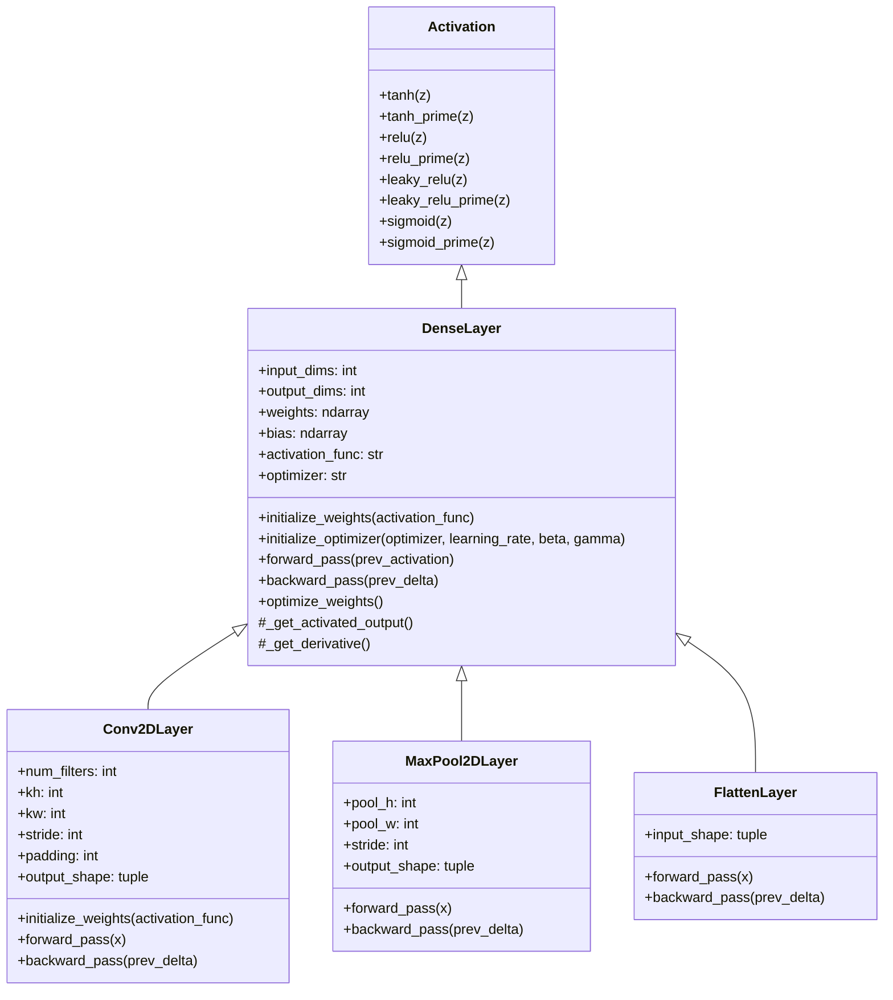

# Deep Learning Framework from Scratch (NumPy)

A lightweight, extensible deep learning library implemented from scratch in pure NumPy — without PyTorch or TensorFlow. Built to demonstrate forward propagation, backpropagation, vectorization via matrix operations, and gradient-based optimization algorithms. Supports both fully connected feedforward networks (FNNs) and 2D convolutional neural networks (CNNs).

---

## Class Hierarchy & Architecture

The framework uses an object-oriented, single-inheritance design centered around `DenseLayer` as the core trainable layer abstraction.



### Inheritance Breakdown

1. **`Activation`**: Base mathematical mixin providing non-linear functions (`relu`, `leaky_relu`, `tanh`, `sigmoid`) and their derivatives (`relu_prime`, `leaky_relu_prime`, etc.).
2. **`DenseLayer(Activation)`**: The foundational layer class. Encapsulates parameter state (`weights`, `bias`), optimizer state, initialization, forward transform, error backpropagation, and element-wise optimizer weight updates (`grad`, `grad-momentum`, `adagrad`, `rmsprop`).
3. **`Conv2DLayer(DenseLayer)`**: Inherits directly from `DenseLayer`. Overrides weight shape `(num_filters, C, kh, kw)` and spatial forward/backward transforms via matrix-based `im2col`/`col2im` operations, while inheriting optimizer initialization, parameter updates (`optimize_weights`), and activation calculation directly from `DenseLayer`.
4. **`MaxPool2DLayer(DenseLayer)`**: Inherits from `DenseLayer`. Overrides spatial max-pooling forward pass (caching `argmax` positions) and backward pass (scattering output gradients), turning parameter initialization and updates into no-ops.
5. **`FlattenLayer(DenseLayer)`**: Inherits from `DenseLayer`. Serves as a shape adapter bridging 4D spatial feature maps `(N, C, H, W)` into 2D matrices `(N, features)` for dense classification heads.

---

## Core Components

### 1. `Loss`
- **Mean Squared Error (`mse` / `mse_prime`)**: Standard quadratic loss for regression or basic classification.
- **Binary Cross-Entropy (`binary_cross_entropy` / `bce_prime`)**: Logarithmic loss with $\epsilon$-clipping ($10^{-9}$) to ensure numerical stability and prevent $\log(0)$ NaNs.

### 2. `Activation`
Pluggable non-linearities:
- `relu` / `relu_prime`
- `leaky-relu` / `leaky_relu_prime` (configurable $\alpha$, default `0.01`)
- `sigmoid` / `sigmoid_prime` (numerically stable sign-branching logic)
- `tanh` / `tanh_prime`
- Linear / Pass-through (returns $z$ directly, useful for logits)

### 3. Pluggable Optimizers
Configured per layer or globally at the network level:
- **`"grad"`**: Standard Stochastic / Batch Gradient Descent.
- **`"grad-momentum"`**: Exponentially weighted moving average of gradients ($\beta$, default `0.9`).
- **`"adagrad"`**: Adaptive learning rate scaling based on accumulated sum of squared gradients ($\delta = 10^{-7}$).
- **`"rmsprop"`**: Exponentially decaying average of squared gradients ($\gamma$, default `0.99`).

---

## Layer Specifications & API Reference

### `DenseLayer(input_dims, output_dims)`
- Fully connected layer mapping `(N, input_dims)` $\to$ `(N, output_dims)`.
- Weight initialization: He initialization for ReLU/Leaky-ReLU ($\sqrt{2 / n_{\text{in}}}$), Xavier/Glorot for Sigmoid/Tanh ($\sqrt{1 / n_{\text{in}}}$).

### `Conv2DLayer(input_shape, num_filters, kernel_size, stride=1, padding=0)`
- 2D Convolutional layer operating on feature maps `(N, C, H, W)`.
- Computes output height and width: $H_{\text{out}} = \lfloor\frac{H + 2p - kh}{s}\rfloor + 1$.
- Uses `im2col` to convert patch extraction into a single GEMM matrix product ($X_{\text{col}} \cdot W_{\text{col}}$).

### `MaxPool2DLayer(input_shape, pool_size=2, stride=None)`
- Downsamples feature maps by taking the maximum value across $k_h \times k_w$ windows.

### `FlattenLayer(input_shape=None)`
- Reshapes `(N, C, H, W)` tensors to `(N, C \times H \times W)` matrices.

### `Network(optimizer="grad", cost="mse")`
Container class providing high-level model construction and training routines:
- `add_layer(...)` / `add_conv2d(...)` / `add_maxpool2d(...)` / `add_flatten(...)`: Helper methods to construct and append layers.
- `forward(X)`: Sequential forward pass.
- `backward(y)`: Computes loss gradient at output and backpropagates through layers in reverse order, executing parameter updates.
- `train(X, y, epochs=100, batch_size=None, shuffle=True, verbose=True)`: Full training loop supporting Full-Batch, Mini-Batch, or Stochastic Gradient Descent.
- `predict(x_test)`: Forward pass inference.
- `save_network(name="network", path=None)` / `load_network(path)`: Persists layer array to disk via NumPy binary `.npy` format.

---

## Usage Examples

### 1. Fully Connected Neural Network (MNIST)

```python
import numpy as np
from neural_nets_from_scratch2 import Network

# Create network with RMSProp optimizer and MSE loss
net = Network(optimizer="rmsprop", cost="mse")

# Add fully connected layers: 784 -> 128 -> 64 -> 10
net.add_layer(784, 128, activation="relu", alpha=0.001)
net.add_layer(128, 64, activation="relu", alpha=0.001)
net.add_layer(64, 10, activation="sigmoid", alpha=0.001)

# Train on dataset
net.train(X_train, y_train, epochs=30, batch_size=64, shuffle=True)

# Predict
predictions = net.predict(X_test)
```

### 2. Convolutional Neural Network (CNN)

```python
import numpy as np
from neural_nets_from_scratch2 import Network

# Initialize network
net = Network(optimizer="rmsprop", cost="mse")

# Add 2D Convolution: Input (1, 28, 28) -> Output (8, 26, 26)
out_shape1 = net.add_conv2d(input_shape=(1, 28, 28), num_filters=8, kernel_size=3, activation="relu", alpha=0.001)

# Add MaxPool2D: (8, 26, 26) -> Output (8, 13, 13)
out_shape2 = net.add_maxpool2d(input_shape=out_shape1, pool_size=2)

# Flatten feature map to 2D matrix: (8, 13, 13) -> 1352 features
net.add_flatten()

# Dense classification head: 1352 -> 10
net.add_layer(1352, 10, activation="sigmoid", alpha=0.001)

# Train CNN on 4D image data (N, C, H, W)
net.train(X_train_4d, y_train_oh, epochs=10, batch_size=32)
```

---

## Executing MNIST Benchmark

Run the included end-to-end training script:

```bash
python train_mnist.py
```

**Dependencies:** `numpy`, `scikit-learn`